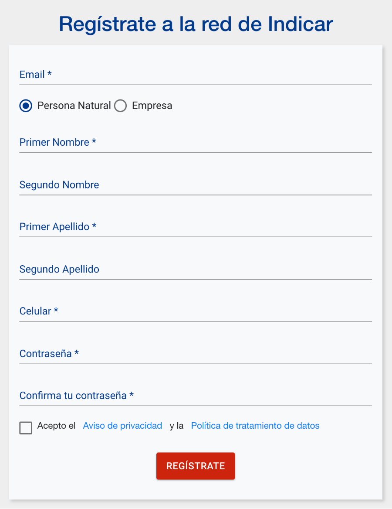
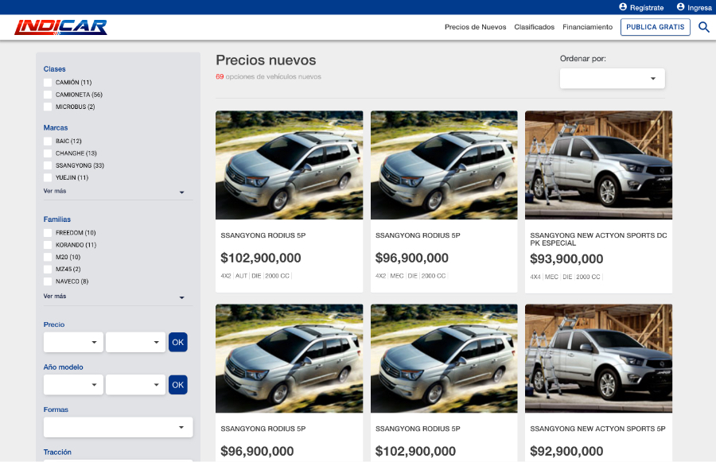

### Publica un clasificado
---
<a target="_blank" href="https://www.indicar.com.co/registro">Regístrate en Indicar</a>

Una vez se haya registrado, debe hacer clic en el botón PUBLICA GRATIS que se encuentra en el menú superior derecho. Aquí se desplegará la información que debe diligenciar del vehículo a publicar.  La página lo va llevando para que en una secuencia lógica complete los pasos necesarios.

 
Una vez se publique el clasificado de venta, un moderador (persona de INDICAR que aprueba o rechaza los clasificados) deberá aprobarlo antes de que sea subido a la vitrina.  Por lo que quedará “En aprobación”.

Para que el usuario pueda ver los clasificados de compra que ha publicado, debe hacer clic en su nombre en el menú superior derecho y luego debe hacer clic en el enlace MIS CLASIFICADOS. 

Cada clasificado tendrá su propia tarjeta en donde se mostrará la información del vehículo y el estado del clasificado. Adicionalmente, el usuario tendrá la opción de ver, editar, anular y marcar como vendido. https://www.indicar.com.co/cuenta/(cuenta-opcion:clasificado/A)

Los clasificados tendrán una validez de 60 días. Si se completa ese periodo y el usuario no ha desactivado el clasificado, el clasificado automáticamente se inactivará. Esto ocurre con el fin de que en la vitrina de clasificados no estén cargados clasificados de vehículos que ya se han vendido. 

En caso de que un clasificado sea rechazado por un moderador, se le enviará un correo al usuario con una nota explicando el motivo de rechazo del clasificado. El usuario entonces deberá ir a la página MIS CLASIFICADOS, hacer clic en “EDITAR”, y corregir la información. Una vez el usuario edite el clasificado, éste quedará en estado “En aprobación” pendiente nuevamente a la espera de que el moderador lo apruebe. 

**Utilidades adicionales**

Adicionalmente, el módulo de usados tiene dos secciones en la página principal llamadas gangas del momento y único dueño, similares a la sección lanzamientos del módulo de nuevos. 

En la sección gangas del momento aparecerán los 4 vehículos usados con mayor costo-beneficio en la base de datos. La idea con esta sección es premiar a los clasificados con mejor costo-beneficio y que los usuarios del sitio puedan encontrar fácilmente estos clasificados. 

De manera similar, la sección único dueño busca premiar de cierta manera los vehículos que han tenido un solo propietario.

<!-- Página siguiente -->
 

[Anterior](page.html#/cap10.md)
[Siguiente](page.html#/cap12.md)