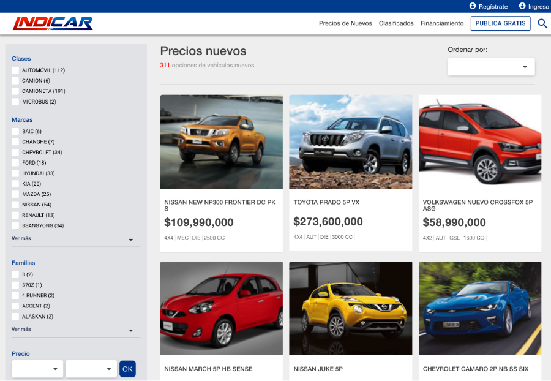
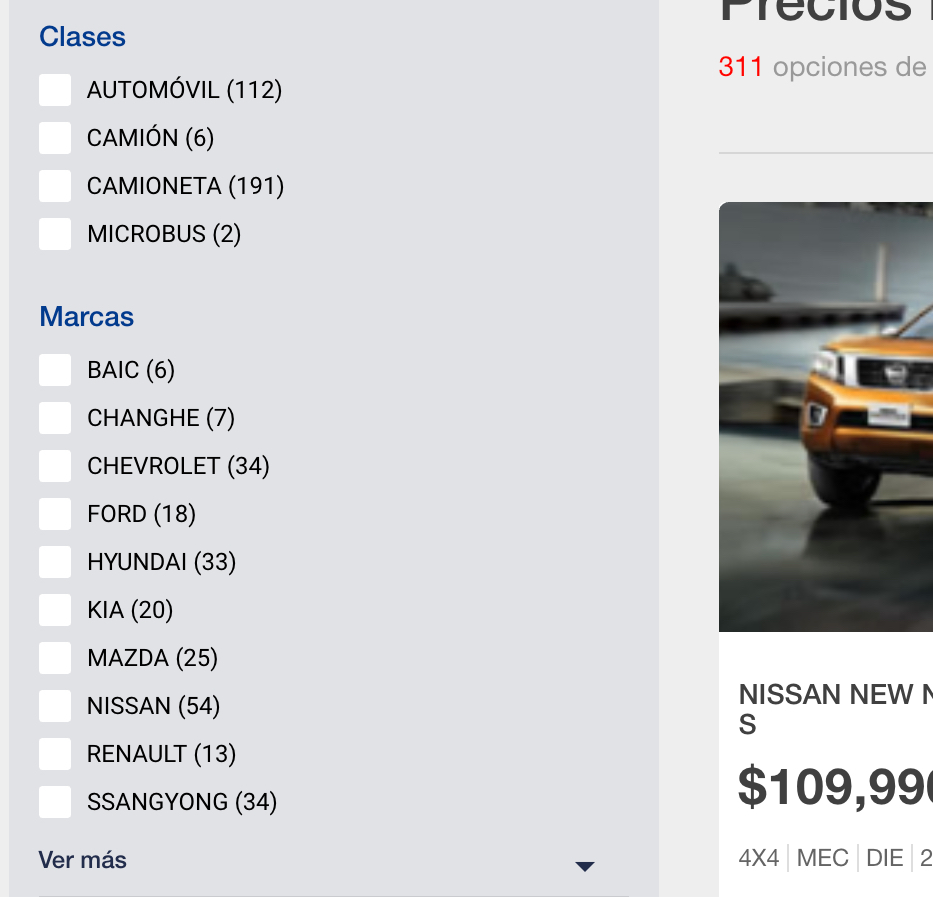

### MÓDULO NUEVOS
---
- Conocer las características, funcionalidades y widgets del módulo de nuevos
- Estar en capacidad de socializar este módulo con los prospectos.

El módulo de nuevos es una vitrina donde se muestran los vehículos nuevos que están siendo comercializados en el país. La información técnica de este módulo proviene de Libro Azul. Todos los vehículos están nombrados de una manera estándar, dependiendo de sus características técnicas. Además, para cada vehículo hay información técnica, precio, fotos del exterior, interior, y en algunos casos de los diferentes colores en los que se comercializan.  

¿Cómo se ingresa al módulo de nuevos? https://www.indicar.com.co/nuevo

 

 

Esta búsqueda le permite al usuario realizar un filtro por clase, marca, familia, modelo, presupuesto, y/o El usuario puede seleccionar cualquier combinación de filtros. Vale la pena resaltar que ningún campo en la búsqueda es obligatorio.

Por cada línea modelo se muestra una tarjeta. La tarjeta contiene información del año modelo; el logo de la marca; el nombramiento estándar dado por el sistema de acuerdo a las características técnicas del vehículo; una sección de características técnicas destacadas que varía de dependiendo si el carro es nuevo o usado y dependiendo de la clase; el precio de venta; y botones para agregar a favoritos y para comparar con otros vehículos. 
Los botones de favoritos y comparar serán explicados más detalladamente en una sección posterior. 

Los vehículos en la vitrina están organizados por orden de más reciente a más antiguo en publicación en la base de datos. Para seleccionar otra opción de organización, se debe hacer clic en la parte superior derecha de la página. Las posibles opciones de organización para la vitrina de vehículos nuevos son:

- Precio bajo
- Precio alto
- Recientes

¿Cuáles son los filtros del módulo de nuevos?
Para filtrar se debe usar la columna en el margen izquierdo de la página. Los filtros en dicha columna están divididos en categorías. 

Cada categoría puede tener una o varias opciones. Sin embargo, sólo se puede seleccionar una opción por cada categoría a la vez. Por ejemplo, en la categoría Marcas, el usuario únicamente puede seleccionar una marca a la vez. Al lado derecho de cada opción hay un número entre paréntesis. 

<!-- Página siguiente -->
 

[Anterior](page.html#/cap8.md)
[Siguiente](page.html#/cap10.md)
